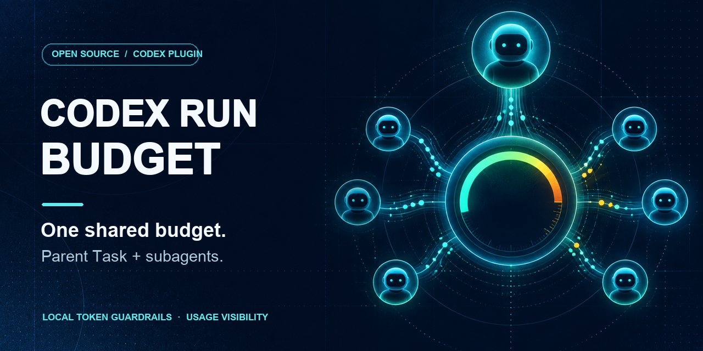

# Codex Run Budget

**Shared token guardrails and local usage visibility for Codex Tasks and subagents.**

[English](README.md) · [繁體中文](README.zh-Hant.md) · [简体中文](README.zh-Hans.md) · [日本語](README.ja.md)



Codex Run Budget is a local Codex plugin for **one shared budget across a parent Task and its subagents**. It also provides automatic turn receipts, scoped usage reports, native account quota observations, and optional workflow and `codex exec` activity views. Budget decisions use a deterministic Python and SQLite ledger; reporting and observation features do not start a budget by themselves.

This is an independent community project inspired by the run-scoped governance ideas in [Microsoft TokenOps](https://commandline.microsoft.com/tokenops-real-time-run-scoped-cost-control-ai-agents/). It is not an OpenAI or Microsoft product and is not a billing meter or a zero-overshoot guarantee. Python 3.10+ and the standard library are sufficient at runtime.

[Quick start](#quick-start) · [Capabilities](#capabilities) · [Commands](#commands-by-task) · [Enforcement limits](#enforcement-and-limits) · [Documentation](#documentation)

## Quick start

Install from this repository's Codex marketplace:

```sh
codex plugin marketplace add https://github.com/easyvibecoding/codex-run-budget
codex plugin add codex-run-budget@codex-run-budget
```

In the Codex CLI, open `/hooks`, review and trust the plugin's hook definitions, then start a **new Task**. An installed or enabled plugin with untrusted or modified hooks may have those hooks skipped.

To start a shared budget, put one control line at the **start of a Task message**:

```text
run-budget:start tokens=100k

Implement the feature and run the relevant checks.
```

The ceiling covers the parent session tree. Starting a budget creates a new audit epoch and preserves earlier epoch history. Choose a ceiling that can cover at least one full model request; there is no hook before every model request.

```text
run-budget:status
run-budget:halt reason="operator pause"
run-budget:resume tokens=200k
run-budget:off
```

`resume tokens=` sets a new absolute ceiling above observed spend. A control line quoted later in a message does not activate a command. [Control syntax, policy order, and state](docs/DESIGN.md) · [Run inspection](#inspect-a-budget-run).

Automatic usage cards are enabled by default even when no budget is active. An eligible subagent can show its own card on its page; the parent card keeps a separate observed descendant subtotal. A matching hashed `@selector` identifies the child in both views. The child's card names its direct parent and distinguishes its own usage from descendants; conflicting lineage stays unverified. [Turn receipts](docs/AUTO_REPORTS.md).

## Capabilities

| Area | What it does | Boundary |
| --- | --- | --- |
| Shared run governance | Uses the parent `session_id` and one SQLite ledger for parent and descendant hooks; applies token, tool, agent, in-flight, repeat, and output guards with STEER then HALT. | Enforces only at supported hook boundaries. |
| Automatic turn receipts | Shows optional pre-final cards for the parent and each eligible subagent on their own pages, saves local Stop/SubagentStop receipts, and may publish a bounded completion revision. | Each card is a snapshot; missing counters or lineage stay partial or unknown. |
| Scoped Task reports | Selects one Task, its agent tree, or explicit time windows; shows observed tokens, historical settings, cache-read share, and setting-change signals. | A cross-Task window requires explicit scope; reports do not start a budget. |
| Native meter | Reads account quota and saved snapshots, local Task configuration history, dated rates, and Standard/Fast credit scenarios. | Account percentages and estimated credits are not Task charges or actual billing. |
| Diagnostics | Audits exact local transcripts, surveys a bounded recent cohort, and captures explicit workflow observations with cursors. | Observation does not imply a live process, completed work, or recurring monitoring. |
| Project exec activity | Lists or watches extra `codex exec` sessions for one working directory; an optional launcher records ephemeral invocation receipts. | Exec invocation usage is separate from native child lineage and the shared budget ledger. |
| Experimental paired project reviews | Users register named pairs of exact Codex project roots. A trusted `Stop` hook can open one review Task in the other project and bind the two Tasks for later summary relay. One project may belong to several pairs. | Global and per-pair switches control the feature. No timed polling; remote-only changes need a later paired Task or manual scan. |
| Signed runtime updates | Activates compatible publisher-signed runtime and CLI changes for new Tasks while existing Tasks keep their pinned version. | New hook, entry, key, or plugin structure still needs normal installation and trust review. |

This README is available in four languages. Human-readable cards, reports, menus, and summaries use nine bundled languages; commands, JSON, status codes, native names, and model IDs remain unchanged. [Localization](docs/LOCALIZATION.md).

## Commands by task

Commands below run from a repository checkout. From an installed plugin directory, use `python3 scripts/run_budget.py` instead. [Full guide index](docs/README.md).

### Inspect a budget run

```sh
python3 plugins/codex-run-budget/scripts/run_budget.py list
python3 plugins/codex-run-budget/scripts/run_budget.py show latest --json
python3 plugins/codex-run-budget/scripts/run_budget.py events latest
```

The ledger stores counters, policy decisions, times, and hashed lineage keys. It does not intentionally store prompts or tool bodies. [Design](docs/DESIGN.md) · [Security](SECURITY.md).

### Read or control automatic receipts

```sh
python3 plugins/codex-run-budget/scripts/run_budget.py auto-report status
python3 plugins/codex-run-budget/scripts/run_budget.py auto-report list
python3 plugins/codex-run-budget/scripts/run_budget.py auto-report disable
python3 plugins/codex-run-budget/scripts/run_budget.py auto-report enable
```

An explicit disabled setting survives upgrades. To include only turns longer than 300 seconds, use `auto-report enable --threshold-seconds 300`. The default threshold is zero. `SubagentStart` identifies a child's own Task and turn for its card; `SubagentStop` settles its own receipt and supplies bounded evidence for ancestor cards. Stop may precede the final persisted usage record; a report-only worker can check that exact turn's completion and save a separate revision. Original receipts and pre-final cards remain unchanged. Run Budget's existing `SubagentStart` hook definition is unchanged by a compatible signed runtime update, so existing native trust remains valid; a new Task is needed to load that runtime. [Receipt lifecycle](docs/AUTO_REPORTS.md).

### Report selected Tasks and agents

```sh
python3 plugins/codex-run-budget/scripts/run_budget.py report
python3 plugins/codex-run-budget/scripts/run_budget.py report tasks --limit 10
python3 plugins/codex-run-budget/scripts/run_budget.py report task --windows 24h
python3 plugins/codex-run-budget/scripts/run_budget.py report agents
python3 plugins/codex-run-budget/scripts/run_budget.py report tree --thread TASK_SELECTOR --windows 24h
python3 plugins/codex-run-budget/scripts/run_budget.py report window --all-tasks --windows 5h
```

Bare `report` is a no-scan menu. `task` and `window` default to the current Task; `report task` selects only that Task, including when it is a subagent. `agents` is a metadata view, while `tree` explicitly includes descendant usage for a selected parent. A subagent's own total can already be present in the parent's tree subtotal; do not add them together. Cross-Task analysis requires `--all-tasks` and an explicit window. Reports save private Markdown, HTML, or JSON; short CLI output links to the file unless `--full` is requested. In Codex, use the bundled `usage-task`, `usage-agents`, and `usage-window` skills. The 0.18.0 report adds per-window cache-read share, request counts, and observed model, reasoning-effort, or service-tier changes without inferring cache-miss causes. [Scope and evidence](docs/REPORTS.md).

### Read native account quota

```sh
python3 plugins/codex-run-budget/scripts/run_budget.py meter --no-save
python3 plugins/codex-run-budget/scripts/run_budget.py meter snapshot
python3 plugins/codex-run-budget/scripts/run_budget.py meter report
python3 plugins/codex-run-budget/scripts/run_budget.py meter tasks --days 1
python3 plugins/codex-run-budget/scripts/run_budget.py meter rates
python3 plugins/codex-run-budget/scripts/run_budget.py meter estimate --days 1
```

`meter` uses the signed-in Codex account connection for native quota; `--no-save` avoids a saved snapshot. `tasks` summarizes bounded local history without a new quota request. `rates` is a dated reference and `estimate` is a counterfactual Standard/Fast token-credit scenario, not a charge. Native percentages are account-wide and are never assigned to one Task from token totals. [Meter and controls](docs/METER.md) · [Measurement mechanics](docs/METER_MECHANICS.md).

### Investigate activity

```sh
python3 plugins/codex-run-budget/scripts/run_budget.py survey
python3 plugins/codex-run-budget/scripts/run_budget.py audit /path/to/synthetic-rollout.jsonl
python3 plugins/codex-run-budget/scripts/run_budget.py workflow
python3 plugins/codex-run-budget/scripts/run_budget.py workflow observe --thread TASK_SELECTOR
python3 plugins/codex-run-budget/scripts/run_budget.py exec-activity list --project "$PWD"
```

`survey` reads a bounded recent local cohort; `audit` reads only explicitly supplied transcript paths. The `workflow-observe` skill can resolve a work description to exact Tasks and capture a private, read-only change report. `workflow observe` defaults to the current Task; descendants require `--include-agents` and a later comparison uses the returned `--after` cursor. Neither observation starts a daemon or a recurring automation. `exec-activity watch` runs only in the foreground; `exec-activity run` is an opt-in launcher that starts the supplied Codex invocation. [Survey](docs/SURVEY.md) · [Audit](docs/AUDIT.md) · [Workflow observation](docs/WORKFLOW_OBSERVATIONS.md) · [Exec activity](docs/EXEC_ACTIVITY.md).

### Review paired project changes

```sh
python3 plugins/codex-run-budget/scripts/paired_review.py pair --id web-api /path/to/web /path/to/api
python3 plugins/codex-run-budget/scripts/paired_review.py feature on
python3 plugins/codex-run-budget/scripts/paired_review.py enable web-api
python3 plugins/codex-run-budget/scripts/paired_review.py pairs
python3 plugins/codex-run-budget/scripts/paired_review.py scan
```

This experimental feature is off on fresh installations and for newly registered pairs. Each pair has independent cursors, pending reviews, and one-to-one Task bindings. The trusted `Stop` hook checks enabled pairs touching the current project; a new `main` range requests a read-only review Task through Codex App in the other project. Later Stops relay short summaries to the same bound Task, with an echo guard. Manual `scan` queues remote-only changes without waking a model. An existing configured pair keeps its prior state and enabled status. [Specific Run Budget and Usage Reports contract](docs/CROSS_REPO_REVIEW.md) · [Setup, switches, and recovery](docs/PAIRED_REVIEW_AUTOMATION.md).

### Check or change installed software

```sh
python3 plugins/codex-run-budget/scripts/run_budget.py updates check --refresh --cwd "$PWD"
python3 plugins/codex-run-budget/scripts/publisher_updates.py status
```

`updates check` reads the installed **package** version and native hook trust. The publisher command reads the **active signed runtime** version; from the installed plugin directory it also accepts `on`, `off`, `update`, and `rollback`. Routine compatible signed runtime updates retain hook definitions. Structural changes follow the normal plugin update, `/hooks` review, and new-Task flow; the retention helper protects old cache versions when that package update is necessary. [Signed updates](docs/SIGNED_UPDATES.md) · [Trust notices](docs/UPDATE_NOTICES.md) · [Upgrade safety](docs/UPGRADE_SAFETY.md).

## Enforcement and limits

The Governor reconciles observed transcript counters and applies deterministic policy inside SQLite transactions. One parent `session_id` is the shared run key; hook retries and concurrent agent admissions are idempotent. The configurable start line supports `tokens`, `warn`, `block_agents`, `tools`, `agents`, `inflight`, `output`, `repeat_steer`, `repeat_halt`, and `fail`. Unknown or duplicate options are rejected. [Configuration and ordering](docs/DESIGN.md) · [Reliability hardening](docs/HARDENING.md).

`UserPromptSubmit` can block a new user turn; `PreToolUse` can block supported local tool calls after HALT. Codex does not expose a plugin hook before every model request. Hosted tools may bypass local tool hooks. Transcript token counters can arrive after the model or tool action, so a turn can overshoot before the ledger observes HALT. Output checks occur after execution and cannot undo side effects. Once HALT is observed, later supported calls and new turns are refused until resume or off. These are guardrails, not universal mediation, exact billing, or zero-overshoot enforcement. [Installed evidence and limits](docs/VALIDATION.md).

## Privacy and local data

State defaults to `~/.codex/run-budget/`; set `CODEX_RUN_BUDGET_HOME` to use another private directory. The ledger does not intentionally record prompts, commands, tool bodies, or transcript content; it keeps allowlisted counters, statuses, timestamps, and hashed identities. Private human reports can display native Task and agent names; keep real exports out of Git. Governance and offline diagnostics do not upload reports. Native meter calls use the existing Codex account connection; signed updates fetch public release bytes. [Security policy](SECURITY.md).

## Documentation

The [documentation index](docs/README.md) groups usage guides, measurement semantics, update and trust controls, architecture, and dated validation. [Contributing](CONTRIBUTING.md) covers checks and synthetic fixtures. [Changelog](CHANGELOG.md) records versions.

MIT © EasyVibeCoding contributors. [Prior art and attribution](NOTICE.md) · [Third-party notices](THIRD_PARTY_NOTICES.md).
